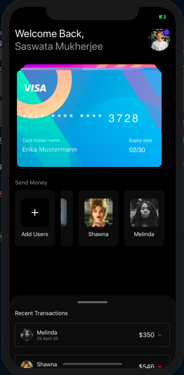
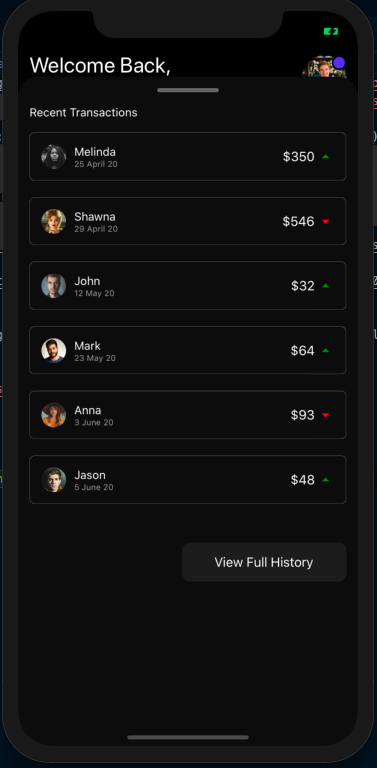

# React Native Finance App
A finance app UI built using React Native, Expo, SnapCarousel and SlidingUpPanel.

## Screenshot

## To Run
- Clone into repo
- Run `yarn`
- Run `yarn ios` or `yarn android`